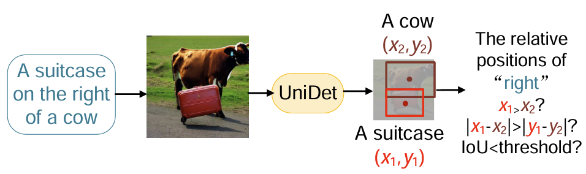
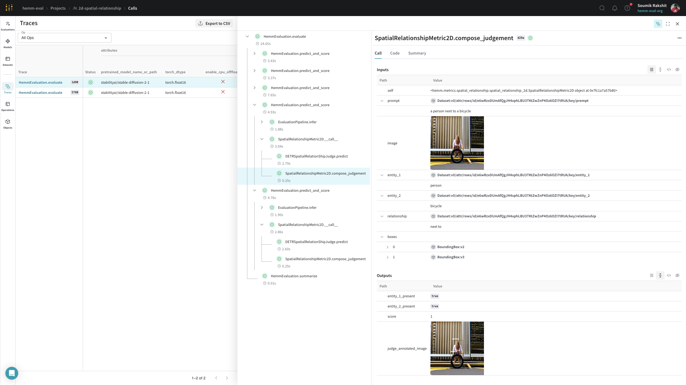

# Spatial Relationship Metrics

This module aims to implement the Spatial relationship metric described in section 3.2 of [T2I-CompBench: A Comprehensive Benchmark for Open-world Compositional Text-to-image Generation](https://arxiv.org/pdf/2307.06350.pdf).

|  | 
|:--:| 
| Using an object-detection model for spatial relationship evaluation as proposed in [T2I-CompBench](https://arxiv.org/pdf/2307.06350.pdf) |

|  | 
|:--:| 
| Weave gives us a holistic view of the evaluations to drill into individual ouputs and scores. |


!!! example
    ## Step 1: Generate evaluation dataset
    
    Generate an evaluation dataset using the MSCOCO object vocabulary and publish it as a Weave Dataset.
    You can follow [this notebook](./notebooks/generate_spatial_relationship_dataset.ipynb) to learn about the porocess.

    ## Step 2: Evaluate

    ```python
    import asyncio
    import weave

    from hemm.models import DiffusersModel
    from hemm.metrics.spatial_relationship import SpatialRelationshipMetric2D
    from hemm.metrics.image_quality import LPIPSMetric, PSNRMetric, SSIMMetric

    # Initialize Weave
    weave.init(project_name="image-quality-leaderboard")

    # Initialize the diffusion model to be evaluated as a `weave.Model`
    model = DiffusersModel(diffusion_model_name_or_path="CompVis/stable-diffusion-v1-4")

    # Define the judge model for 2d spatial relationship metric
    judge = DETRSpatialRelationShipJudge(
        model_address=detr_model_address, revision=detr_revision
    )

    # Add 2d spatial relationship Metric to the evaluation pipeline
    metric = SpatialRelationshipMetric2D(judge=judge, name="2d_spatial_relationship_score")

    # Evaluate!
    dataset = weave.ref("2d-spatial-prompts-mscoco:v0").get()
    evaluation = weave.Evaluation(dataset=dataset, scorers=[metric])
    summary = asyncio.run(evaluation.evaluate(model))
    ```

## Metrics

:::hemm.metrics.spatial_relationship.spatial_relationship_2d

## Judges

:::hemm.metrics.spatial_relationship.judges
