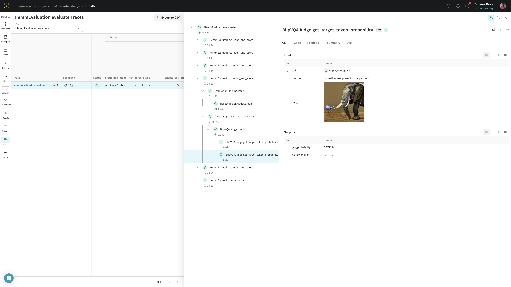

# Disentangled VQA

This module aims to implement the Disentangled VQA metric inspired by Section 4.1 from the paper [T2I-CompBench: A Comprehensive Benchmark for Open-world Compositional Text-to-image Generation](https://arxiv.org/pdf/2307.06350).

|  | 
|:--:| 
| Using the disentangled BLIP-VQA model for attribute-binding evaluation as proposed in [T2I-CompBench](https://arxiv.org/pdf/2307.06350.pdf) |

|  | 
|:--:| 
| Weave gives us a holistic view of the evaluations to drill into individual ouputs and scores. |

!!! example
    ## Step 1: Generate evaluation dataset

    Generate the dataset consisting of prompts in the format `“a {adj_1} {noun_1} and a {adj_2} {noun_2}”` and the corresponding metadata using an LLM capable of generating json objects like GPT4-O. The dataset is then published both as a [W&B dataset artifact](https://docs.wandb.ai/guides/artifacts) and as a
    [weave dataset](https://wandb.github.io/weave/guides/core-types/datasets).

    ```python
    from hemm.metrics.attribute_binding import AttributeBindingDatasetGenerator

        dataset_generator = AttributeBindingDatasetGenerator(
            openai_model="gpt-4o",
            openai_seed=42,
            num_prompts_in_single_call=20,
            num_api_calls=50,
            project_name="disentangled_vqa",
        )

        dataset_generator(dump_dir="./dump")
    ```

    ## Step 2: Evaluate

    ```python
    import wandb
    import weave

    wandb.init(project=project, entity=entity, job_type="evaluation")
    weave.init(project_name=project)

    diffusion_model = BaseDiffusionModel(
        diffusion_model_name_or_path=diffusion_model_address,
        enable_cpu_offfload=diffusion_model_enable_cpu_offfload,
        image_height=image_size[0],
        image_width=image_size[1],
    )
    evaluation_pipeline = EvaluationPipeline(model=diffusion_model)

    judge = BlipVQAJudge()
    metric = DisentangledVQAMetric(judge=judge, name="disentangled_blip_metric")
    evaluation_pipeline.add_metric(metric)

    evaluation_pipeline(dataset=dataset)
    ```

## Metrics

:::hemm.metrics.vqa.disentangled_vqa

## Judges

:::hemm.metrics.vqa.judges.blip_vqa

## Dataset Generation

:::hemm.metrics.vqa.dataset_generator.attribute_binding