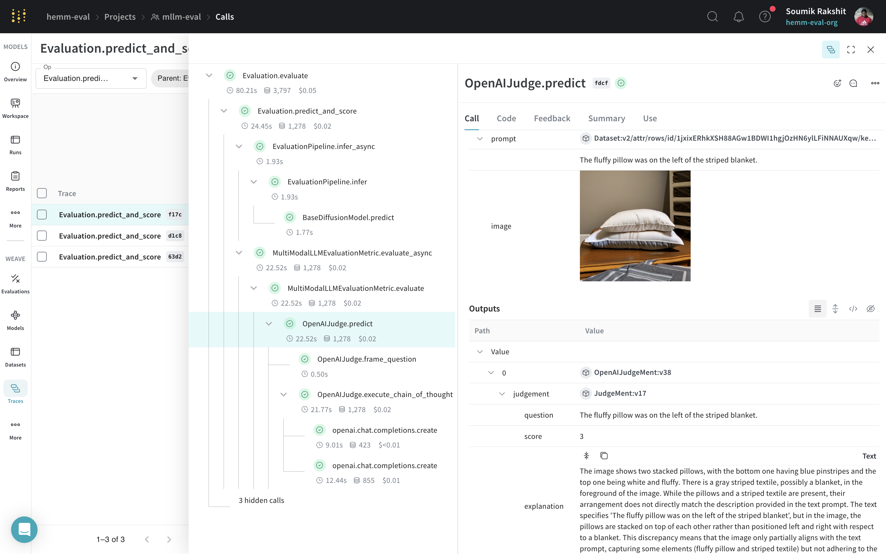

# Multi-modal LLM Based Evaluation

This module aims to implement the Multi-modal LLM based metric inspired by

- Section IV.D of the paper [T2I-CompBench++: An Enhanced and Comprehensive Benchmark for Compositional Text-to-image Generation](https://karine-h.github.io/T2I-CompBench-new/) and
- Section 4.4 of the paper [T2I-CompBench: A Comprehensive Benchmark for Open-world Compositional Text-to-image Generation](https://arxiv.org/abs/2307.06350).

|  | 
|:--:| 
| Using Multi-modal LLM based metric for evaluation a diffusion model. The Weave UI gives us a holistic view of the evaluations to drill into individual ouputs and scores. |


!!! example

    First, download the Spacy English langugage pipeline
    ```shell
    python -m spacy download en_core_web_sm
    ```
    Next, you need to set your OpenAI API key:
    ```
    export OPENAI_API_KEY="<INSERT-YOUR-OPENAI-API-KEY>"
    ```
    Finallly, you can run the following snippet to evaluate your model:
    ```python  
    import wandb
    import weave

    from hemm.eval_pipelines import BaseDiffusionModel, EvaluationPipeline
    from hemm.metrics.vqa import MultiModalLLMEvaluationMetric
    from hemm.metrics.vqa.judges.mmllm_judges import OpenAIJudge, PromptCategory

    wandb.init(project="mllm-eval", job_type="evaluation")
    weave.init(project_name="mllm-eval")

    dataset = weave.ref(dataset_ref).get()

    diffusion_model = BaseDiffusionModel(
        diffusion_model_name_or_path="stabilityai/stable-diffusion-2-1",
        enable_cpu_offfload=False,
        image_height=512,
        image_width=512,
    )
    evaluation_pipeline = EvaluationPipeline(model=diffusion_model)

    judge = OpenAIJudge(prompt_property=PromptCategory.complex)
    metric = MultiModalLLMEvaluationMetric(judge=judge)
    evaluation_pipeline.add_metric(metric)

    evaluation_pipeline(dataset=dataset)
    ```

## Metrics

:::hemm.metrics.vqa.multi_modal_llm_eval

## Judges

:::hemm.metrics.vqa.judges.mmllm_judges.openai_judge